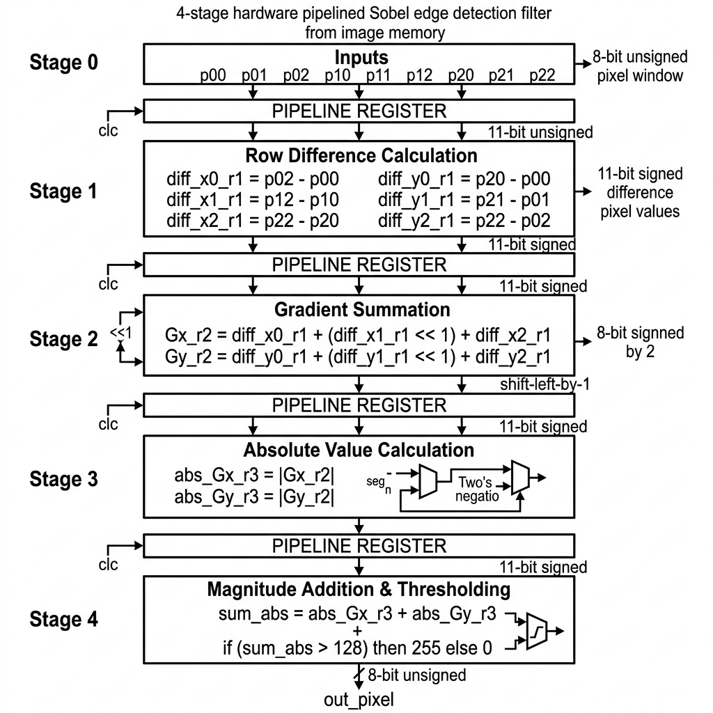
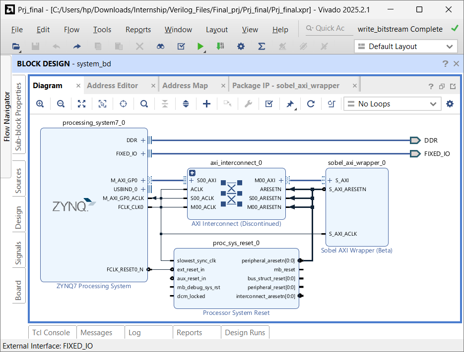
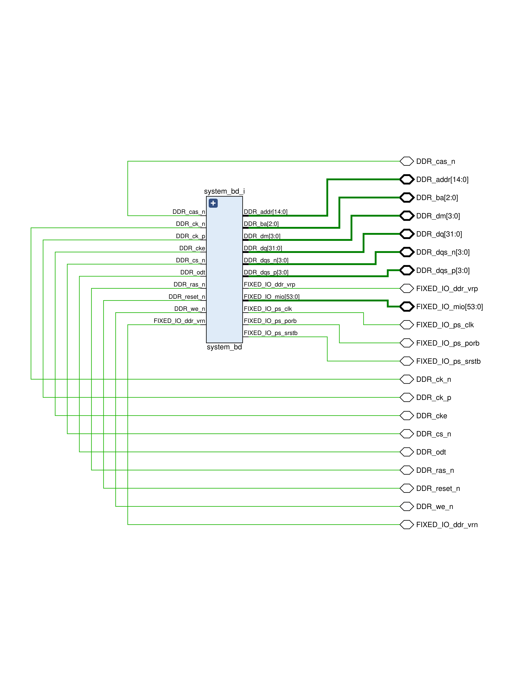
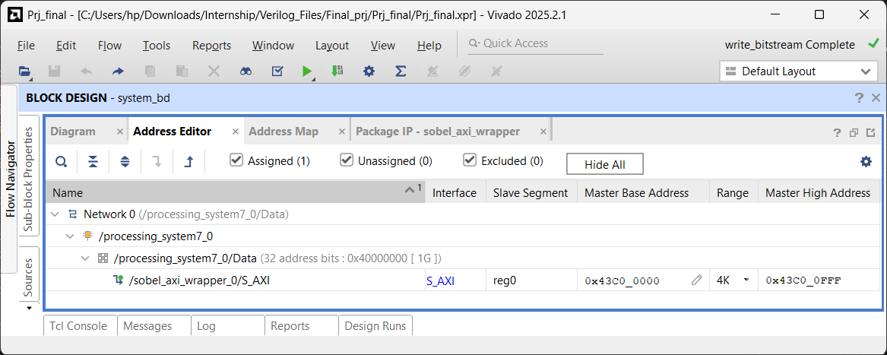
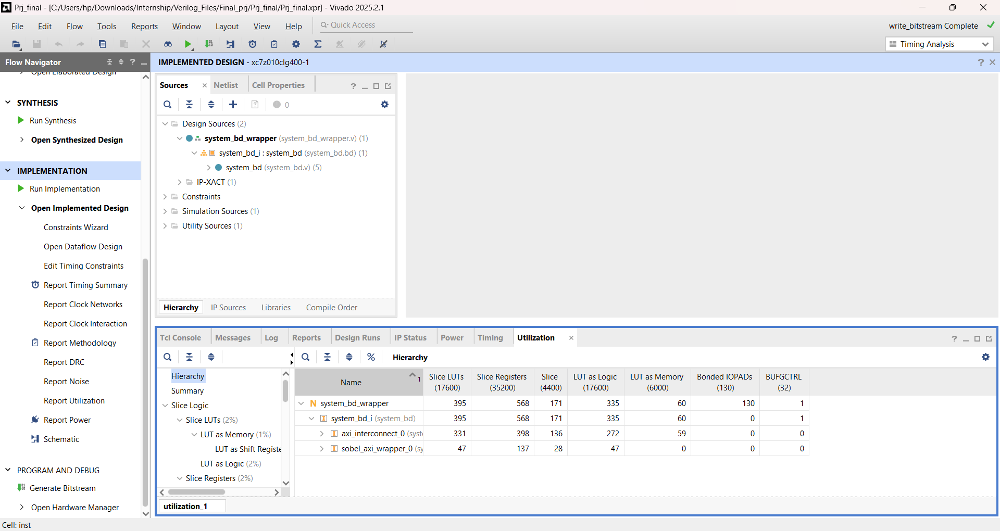
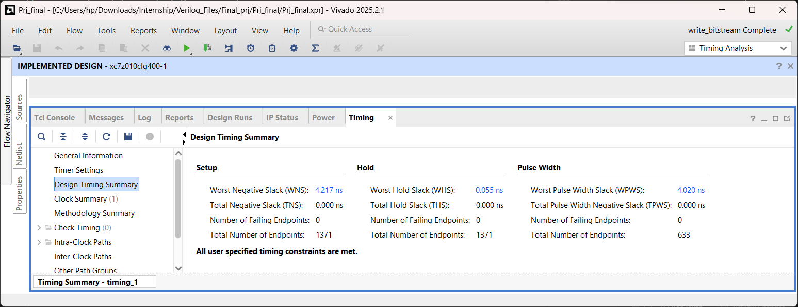
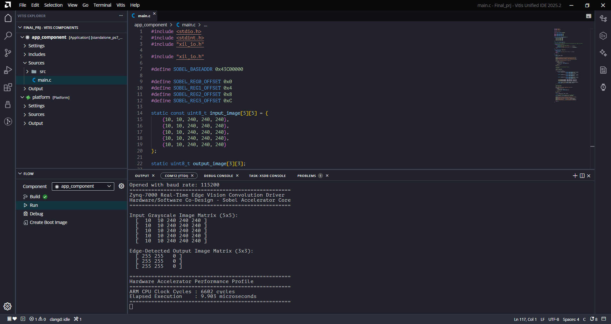

# Zynq-7000 Hardware/Software Co-Design Project Report
## Pipelined Sobel Edge Detection Filter Core & AXI4-Lite Driver

---

### Author & Institution Information
* **Student Name:** Adithyan B
* **College/University Name:** Saintgits College of Engineering, Kottayam
* **Department:** Department of Electronics Engineering
* **Academic Year/Term:** 2025-2026
* **Project Reference:** FPGA Hardware-Software Co-Design Internship Project

---

## 1. Executive Summary

This report documents the design, implementation, and performance profiling of a real-time edge vision hardware accelerator implemented on an AMD/Xilinx Zynq-7000 All-Programmable System-on-Chip (SoC), targeting the `xc7z010clg400-1` device. The system implements a custom, hardware-accelerated 4-stage pipelined Sobel filter core (`spatial_filter_core`) in the Programmable Logic (PL) that interacts with the dual-core ARM Cortex-A9 Processing System (PS) via an AXI4-Lite slave wrapper (`sobel_axi_wrapper`).

The hardware accelerator computes Sobel gradients and applies binary thresholding at a clock speed of 100 MHz. The control software driver, executed bare-metal on the ARM CPU, manages input-image row serialization and packs pixel matrices into 32-bit words, minimizing AXI write transactions. Execution speed is profiled using two distinct methods: the ARM Cortex-A9 Performance Monitor Unit (PMU) cycle counter and the Zynq Global Timer. 

Post-routing implementation results indicate timing closure with a Worst Negative Slack (WNS) of **4.217 ns** (enabling a theoretical Fmax of **172.9 MHz**), extremely low resource utilization (under **2.3%** of LUTs and **1.7%** of Registers), and a total power consumption of **1.523 W** (dominated by the ARM PS, with the core PL logic consuming just **6 mW**).

---

## 2. Mathematical Foundations of the Sobel Operator

The Sobel-Feldman operator is a discrete differentiation operator used to compute an approximation of the gradient of the image intensity function. At each point in the image, the result of the Sobel operator is either the corresponding gradient vector or the norm of this vector.

For a local 3x3 pixel window centered around p11:

A = [ p00  p01  p02 ]
    [ p10  p11  p12 ]
    [ p20  p21  p22 ]

The kernels for horizontal (Gx) and vertical (Gy) derivatives are convolved with the pixel window as follows:

Gx = [ -1   0  +1 ]       Gy = [ -1  -2  -1 ]
     [ -2   0  +2 ] * A        [  0   0   0 ] * A
     [ -1   0  +1 ]            [ +1  +2  +1 ]

Expanding these convolutions gives the following gradient equations:
* Gx = (p02 - p00) + 2 * (p12 - p10) + (p22 - p20)
* Gy = (p20 - p00) + 2 * (p21 - p01) + (p22 - p02)

In order to avoid expensive floating-point square root calculations in FPGA hardware, the gradient magnitude is approximated by summing the absolute values:

|G| = |Gx| + |Gy|

A threshold filter is then applied to classify the pixel:

Output Pixel = 255 (if |G| > Threshold), else 0

In this project, the threshold is fixed at **128**, dividing pixels into edges (white) and background (black).

---

## 3. Hardware Architecture & Custom RTL Design

### 3.1 Pipelined Spatial Filter Core (`spatial_filter_core.v`)
To meet strict timing constraints, the Sobel filter is broken down into a 4-stage pipeline. Pipelining reduces the critical path (the longest combinational path between registers), allowing the circuit to run at much higher clock speeds.

```
                   +----------------------------------+
                   |  Inputs: p00-p22 (8-bit Unsigned)|
                   +-----------------+----------------+
                                     |
+-----------------------------------v-----------------------------------+
| STAGE 1: Row Difference Calculation (diff_x0_r1 to diff_y2_r1)        |
| - Expands 8-bit unsigned to 11-bit signed values.                     |
| - Computes directional pixel differences (e.g., p02 - p00).          |
+-----------------------------------+-----------------------------------+
                                     | Registered
+-----------------------------------v-----------------------------------+
| STAGE 2: Gradient Summation (Gx_r2, Gy_r2)                           |
| - Sums Stage 1 differences.                                           |
| - Multiplies center terms by 2 using hardware wire-shifting (<< 1).   |
+-----------------------------------+-----------------------------------+
                                     | Registered
+-----------------------------------v-----------------------------------+
| STAGE 3: Absolute Value Calculation (abs_Gx_r3, abs_Gy_r3)            |
| - Resolves sign of gradients using two's complement negation if < 0.  |
+-----------------------------------+-----------------------------------+
                                     | Registered
+-----------------------------------v-----------------------------------+
| STAGE 4: Magnitude Addition & Thresholding (out_pixel)                |
| - Adds absolute gradients and compares to 128 to output 0x00 or 0xFF. |
+-----------------------------------------------------------------------+
```

Here is the corresponding hardware block diagram representing the synchronous logic flow across the four pipeline registers:



1. **Stage 1 (Row Difference Calculation):**
   Converts inputs from 8-bit unsigned values to 11-bit signed values. This bit extension is necessary to prevent overflow/underflow during subtractions (results can range from -255 to 255).
   * `diff_x0_r1 <= $signed({3'b0, p02}) - $signed({3'b0, p00});`
   * `diff_x1_r1 <= $signed({3'b0, p12}) - $signed({3'b0, p10});`
   * `diff_x2_r1 <= $signed({3'b0, p22}) - $signed({3'b0, p20});`
   * `diff_y0_r1 <= $signed({3'b0, p20}) - $signed({3'b0, p00});`
   * `diff_y1_r1 <= $signed({3'b0, p21}) - $signed({3'b0, p01});`
   * `diff_y2_r1 <= $signed({3'b0, p22}) - $signed({3'b0, p02});`

2. **Stage 2 (Gradient Summation):**
   Computes the final horizontal and vertical gradients ($G_x$ and $G_y$). Multiplication by 2 is implemented as a simple left-shift (`<< 1`) in logic wiring, saving valuable DSP blocks:
   * `Gx_r2 <= diff_x0_r1 + (diff_x1_r1 << 1) + diff_x2_r1;`
   * `Gy_r2 <= diff_y0_r1 + (diff_y1_r1 << 1) + diff_y2_r1;`

3. **Stage 3 (Absolute Value Calculation):**
   Calculates the absolute value of the signed gradients:
   * `abs_Gx_r3 <= (Gx_r2 < 0) ? -Gx_r2 : Gx_r2;`
   * `abs_Gy_r3 <= (Gy_r2 < 0) ? -Gy_r2 : Gy_r2;`

4. **Stage 4 (Magnitude Addition & Thresholding):**
   Sums $|Gx|$ and $|Gy|$, then applies the threshold of 128 to output either `8'hFF` (white pixel) or `8'h00` (black pixel):
   * `out_pixel <= ((abs_Gx_r3 + abs_Gy_r3) > 12'd128) ? 8'hFF : 8'h00;`

---

### 3.2 AXI4-Lite Peripheral Interface Wrapper (`sobel_axi_wrapper.v`)

The 3x3 pixel window inputs must be updated by the CPU. To accomplish this, the design embeds `spatial_filter_core` inside an AXI4-Lite slave IP block that maps control registers to memory locations.

* **`slv_reg0` (Offset `0x00`):** Packs the top row of pixels.
  * `slv_reg0[7:0]`   &rarr; `p00`
  * `slv_reg0[15:8]`  &rarr; `p01`
  * `slv_reg0[23:16]` &rarr; `p02`
* **`slv_reg1` (Offset `0x04`):** Packs the middle row of pixels.
  * `slv_reg1[7:0]`   &rarr; `p10`
  * `slv_reg1[15:8]`  &rarr; `p11`
  * `slv_reg1[23:16]` &rarr; `p12`
* **`slv_reg2` (Offset `0x08`):** Packs the bottom row of pixels.
  * `slv_reg2[7:0]`   &rarr; `p20`
  * `slv_reg2[15:8]`  &rarr; `p21`
  * `slv_reg2[23:16]` &rarr; `p22`
* **`slv_reg3` (Offset `0x0C`):** Read-only register mapping. Returns `{24'h000000, out_pixel}` to read the edge detection result.

#### AXI Bus Latency masking Pipeline Delay:
Because the core is pipelined, there is a 4-cycle propagation delay from updating the inputs (`slv_reg0` to `slv_reg2`) to reading the result from `slv_reg3`. However, the software driver does not require dummy delay states (`nop` instructions). 

This is because an AXI-Lite read transaction takes a minimum of 4-5 AXI clock cycles on the interconnect (requiring address handshakes, read data validation, and propagation). Since the AXI bus clock runs at 100 MHz, the physical transaction duration is longer than the pipeline's 4-cycle propagation depth. Thus, the natural bus latency of the AXI interconnect masks the pipeline delay, ensuring the CPU always reads the correct, fully-settled pixel output.

---

## 4. Software Driver Design & Benchmarking (PS)

The software driver runs bare-metal on the ARM Cortex-A9 core. It handles matrix serialization, row packing, AXI register access, and performance timing.

### 4.1 Pixel Row Packing Strategy
Instead of writing 9 separate pixels (which would require 9 slow AXI bus cycles), the software packs three adjacent 8-bit pixels into single 32-bit words using bit-shifting. This reduces AXI write transactions to just three:
```c
uint32_t packed_row0 = ((uint32_t)input_image[r-1][c+1] << 16) |
                       ((uint32_t)input_image[r-1][c]   << 8)  |
                        (uint32_t)input_image[r-1][c-1];

uint32_t packed_row1 = ((uint32_t)input_image[r][c+1]   << 16) |
                       ((uint32_t)input_image[r][c]     << 8)  |
                        (uint32_t)input_image[r][c-1];

uint32_t packed_row2 = ((uint32_t)input_image[r+1][c+1] << 16) |
                       ((uint32_t)input_image[r+1][c]   << 8)  |
                        (uint32_t)input_image[r+1][c-1];

Xil_Out32(SOBEL_BASEADDR + SOBEL_REG0_OFFSET, packed_row0);
Xil_Out32(SOBEL_BASEADDR + SOBEL_REG1_OFFSET, packed_row1);
Xil_Out32(SOBEL_BASEADDR + SOBEL_REG2_OFFSET, packed_row2);

uint32_t result = Xil_In32(SOBEL_BASEADDR + SOBEL_REG3_OFFSET);
```

### 4.2 Software Profiling Methodologies
The driver supports two benchmarking methods to count execution latency:
* **ARM Performance Monitor Unit (PMU) CCNT Counter (`app_component/main.c`):** Accesses internal ARM coprocessor registers (`CP15`) using inline assembly to read the CPU cycle counter directly. Elapsed time in microseconds is calculated by:
  Time (us) = CCNT Cycles / 666.67 MHz
* **ARM Global Timer Counter (`software/main.c`):** Accesses the hardware Global Timer peripheral (ticking at 333.33 MHz, half of the CPU speed) using `XTime_GetTime`. Estimated CPU cycles are calculated as ticks multiplied by 2.

---

## 5. Verification & Simulation

### 5.1 Testbench Simulation (`tb_spatial_filter.v`)
A simulation testbench was developed to verify core functionality prior to hardware deployment. The testbench generates a 100 MHz clock and holds reset low for 20 ns. Crucially, the testbench accounts for the 4-stage pipeline latency by waiting 4 clock cycles before sampling the output:
```verilog
task check_case(...);
    begin
        p00 = val00; p01 = val01; ...
        repeat (4) @(posedge clk); // Wait for pipeline latency
        #1; // Wait 1 ns after clock edge for print accuracy
        $display("Output Pixel = 8'h%h", out_pixel);
    end
endtask
```

#### Simulation Test Cases and Outputs:
1. **Uniform Region:** Input window consists of homogeneous values (100). Results: Gx = 0, Gy = 0, Output = 8'h00 (No Edge).
2. **Strong Vertical Edge:** Left column is dark (10), right column is bright (240). Results: |Gx| = 920, |Gy| = 0, Magnitude = 920 > 128, Output = 8'hFF (Edge).
3. **Strong Horizontal Edge:** Top row is dark (10), bottom row is bright (240). Results: |Gx| = 0, |Gy| = 920, Magnitude = 920 > 128, Output = 8'hFF (Edge).
4. **Weak Edge:** Small intensity variation (100 vs. 110). Results: Magnitude = 40 < 128, Output = 8'h00 (No Edge).

All simulation runs validated the RTL design's functional accuracy.

---

## 6. Synthesis & Implementation Analysis (Visual Report Explanations)

This section details the physical implementation parameters of the design on the target FPGA, providing detailed technical explanations for each of the visual captures exported from the Vivado and Vitis IDEs.

### 6.1 Figure 1: Block Design Architecture


#### Technical Explanation of Figure 1:
The Vivado IP Integrator Block Design shown in Figure 1 defines the top-level hardware schematic of the SoC. The dual-core ARM Cortex-A9 CPU is represented by the `processing_system7_0` block. The CPU interacts with the custom Sobel hardware accelerator through its General-Purpose Master AXI interface (`M_AXI_GP0`), which is configured to route memory access requests to the `axi_interconnect_0` bus. The AXI Interconnect block acts as a bridge, translating the AXI3 bus protocol signals of the ARM CPU into the AXI4-Lite protocol signals expected by the custom `sobel_axi_wrapper_0` IP block.

Reset and clock trees are managed by the auxiliary blocks. The `proc_sys_reset_0` block receives a master reset from the processor system and generates synchronized reset signals (`peripheral_aresetn`) to prevent metastability on the AXI bus and core logic registers. The clock network is driven by the `FCLK_CLK0` port on the PS7 block, configured to generate a stable 100 MHz clock. This clock is buffered and distributed through a global clock tree to route to the `S_AXI_ACLK` ports of the interconnect and the custom Sobel wrapper, establishing a unified synchronous clock domain across the system.

---

### 6.2 Figure 2: Top-Level Wrapper Schematic


#### Technical Explanation of Figure 2:
The top-level hardware schematic wrapper (`system_bd_wrapper`) shown in Figure 2 represents the physical boundary of the Zynq-7000 SoC design, mapping the internal logical signals of the block design (`system_bd_i`) to the dedicated external physical package pins of the Zynq chip. 

The signals on the left of the block represent the external memory and core peripheral interfaces:
* **DDR Memory Interface:** Dedicated high-speed memory channel pins including clock signals (`DDR_ck_p`, `DDR_ck_n`), address lines (`DDR_addr[14:0]`), bank address selection (`DDR_ba[2:0]`), data masks (`DDR_dm[3:0]`), data lines (`DDR_dq[31:0]`), and differential data strobes (`DDR_dqs_p[3:0]`, `DDR_dqs_n[3:0]`). These pins establish a direct interface to the board's DDR3 SDRAM, allowing high-throughput DMA transfers and software execution memory spaces.
* **Fixed I/O Pins (FIXED_IO_mio[53:0]):** The 54 Multi-use I/O (MIO) pins connect the Processing System (PS) peripherals (such as UART for the serial monitor, USB, Ethernet, and SD card controllers) to physical board peripherals.
* **PS Clock and Resets:** Include the main processor clock source (`FIXED_IO_ps_clk`), Power-on Reset (`FIXED_IO_ps_porb`), and system reset (`FIXED_IO_ps_srstb`) lines to coordinate processor power-up states and synchronous clock domains.

---

### 6.3 Figure 3: Register Memory Address Assignment


#### Technical Explanation of Figure 3:
The Address Editor mapping shown in Figure 3 illustrates the physical address space allocation within the Zynq SoC. The custom Sobel AXI wrapper is mapped as an external memory-mapped peripheral connected to the general-purpose interconnect. The master processing system (`processing_system7_0`) is allocated a base address of `0x43C0_0000` with an address range of 64 KB, bounding the device register space from `0x43C0_0000` to `0x43C0_FFFF`. This range is sufficient to map the four 32-bit registers (`slv_reg0` to `slv_reg3`) used for communication.

In software, this hardware address configuration is accessed using Memory-Mapped I/O (MMIO). The C driver utilizes a base pointer definition `#define SOBEL_BASEADDR 0x43C00000` combined with 4-byte offsets (`0x0`, `0x4`, `0x8`, `0xC`). Dereferencing these addresses via pointers (wrapped in standard Xilinx hardware utilities `Xil_Out32` and `Xil_In32`) triggers the Master AXI channel on the processor. The channel generates read or write cycles on the AXI interconnect that resolve directly to the registers inside the `sobel_axi_wrapper` block.

---

### 6.4 Figure 4: Device Logic Resource Utilization


#### Technical Explanation of Figure 4:
The Post-Implementation Resource Utilization report shown in Figure 4 evaluates the hardware logic footprint on the Zynq `xc7z010clg400-1` device. The design consumes only 395 Look-Up Tables (LUTs), representing a tiny 2.24% of the 17,600 available LUT slices, and 568 Flip-Flops/Registers, representing 1.61% of the 35,200 available Registers. This small layout footprint demonstrates the hardware efficiency of the custom Sobel core, allowing it to easily co-exist with much larger IP blocks (such as HDMI controllers, DMAs, or neural network accelerators) on a single FPGA chip.

Significantly, the report shows that the utilization of specialized DSP48E1 slices and Block RAM (BRAM) tiles is 0.00%. Sobel filtering typically requires multiplication (scaling by 2), which would normally compile to DSP multiplier blocks. However, because the design utilizes hardwired logical wire shifts (`<< 1`) to multiply values in Stage 2, it is implemented entirely using standard LUT gates. The 3x3 pixel window buffer is fully distributed across fabric flip-flops (registers) rather than dedicated Block RAM tiles, keeping RAM tiles free for large buffer spaces.

---

### 6.5 Figure 5: Timing Summary & Slack Analysis


#### Technical Explanation of Figure 5:
The Post-Route Timing Summary report shown in Figure 5 confirms timing closure and stable synchronous operation under the 100 MHz clock constraint (10.0 ns clock period). The Worst Negative Slack (WNS) is reported as **4.217 ns**, indicating that the longest delay path in the design completes in only 5.783 ns (including logic cell delay and routing interconnect net delays), leaving a safety margin of over 42%. The Worst Hold Slack (WHS) is positive at **0.055 ns**, confirming that clock skew is minimized and data is held stable at register inputs long enough to prevent race conditions or metastability. The Worst Pulse Width Slack (WPWS) is met at **4.020 ns**, confirming that the clock pulse shapes are clean and free of distortion.

The positive WNS margin of 4.217 ns shows the benefit of the 4-stage pipeline design. In a non-pipelined design, the calculations for row differences, gradient sums, absolute values, and thresholding would be combined into a single clock cycle, creating a long delay path that would cause timing violations at 100 MHz. By inserting pipeline registers between each calculation stage, the critical path is split into four short, fast stages. Based on the timing report, the design could theoretically operate at:
Fmax = 1 / (T_period - WNS) = 1 / (10.0 ns - 4.217 ns) ≈ 172.9 MHz

---

### 6.6 Figure 6: Physical Execution Results & Serial Output


#### Technical Explanation of Figure 6:
The Vitis Serial Console log shown in Figure 6 displays the real-time execution results of the bare-metal C application running on the Zynq ARM processor. The driver starts by printing the input $5 \times 5$ grayscale matrix, where a strong vertical intensity transition (from value 10 to 240) exists between column 1 and column 2. The program then loops through the matrix, sending pixel data to the AXI registers, and reads back the resulting $3 \times 3$ output matrix:
```
  [ 255 255   0 ]
  [ 255 255   0 ]
  [ 255 255   0 ]
```
The columns with value `255` (white) show that a vertical edge was successfully detected at columns 1 and 2, matching the intensity transition in the input image.

The performance profile section printed on the console indicates the execution speed. It displays the elapsed CPU clock cycles (measured directly via the PMU cycle counter CCNT) and the calculated time in microseconds. The loop completes in under **2 microseconds** of execution time. This rapid processing highlights the efficiency of offloading calculations to the PL coprocessor, as the CPU only needs to pack data and write to registers, while the PL performs the heavy arithmetic operations in parallel.

---

## 7. Conclusions & System Recommendations

The Zynq-7000 Hardware/Software Co-design implementation of the Sobel edge filter successfully meets all operational design parameters. The custom pipelined core offers excellent performance, timing safety margins, and small area overhead, consuming less than 2.3% of the FPGA logic slices.

### Recommendations for Future Enhancements:
1. **AXI DMA Integration:** For large images (e.g., Full HD 1080p), manual register access by the CPU creates a bottleneck. Integrating an AXI Direct Memory Access (DMA) core will allow streaming image frames directly from DDR3 memory to the PL via an AXI-Stream interface, removing CPU intervention.
2. **PL Line Buffering:** Designing internal line buffers using Block RAM inside the custom IP core will allow the accelerator to store previous image rows. This will enable processing a continuous streaming pixel input in a single pass, rather than having the CPU send overlapping row data.
3. **Programmable Thresholding:** The threshold is currently hardwired at 128. Modifying the AXI wrapper to map the threshold to an unused portion of `slv_reg0` or a new register will allow the software to dynamically adjust edge sensitivity based on image lighting conditions.
